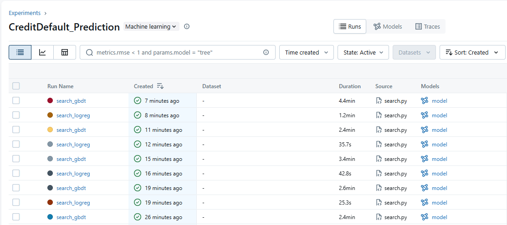
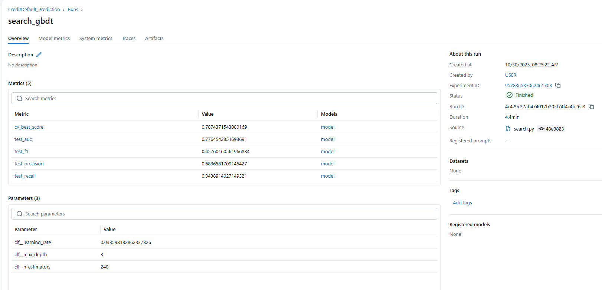
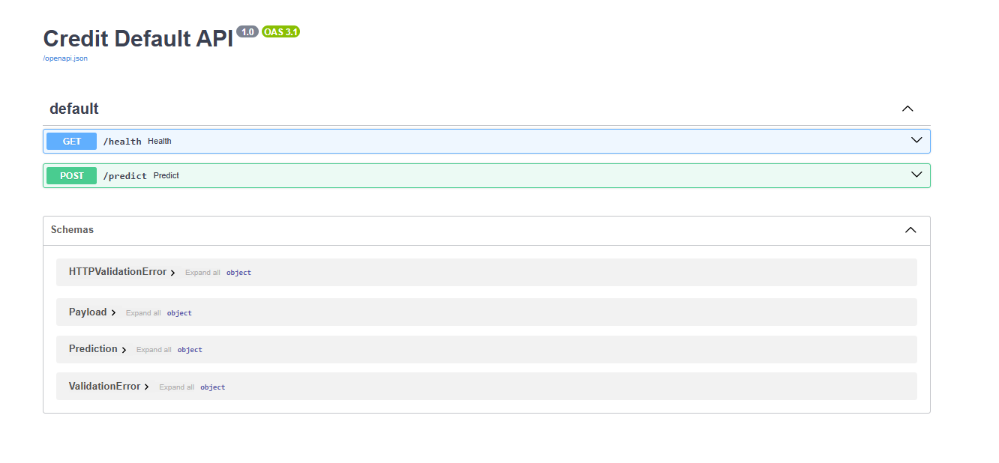
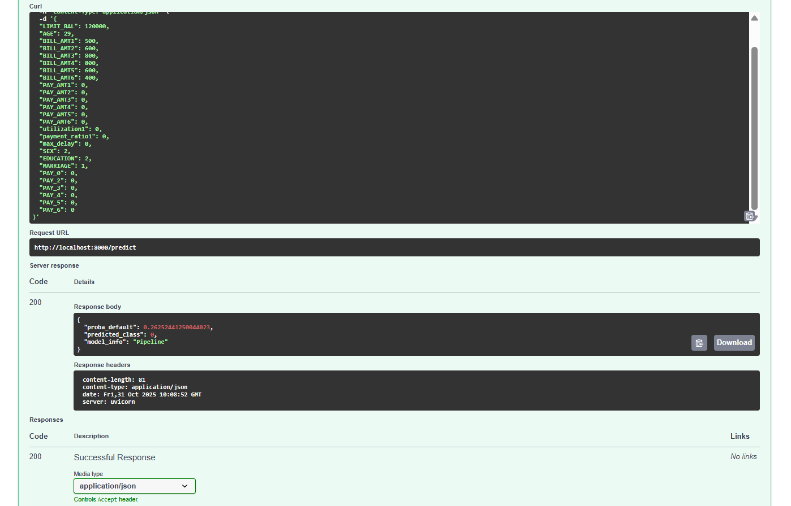
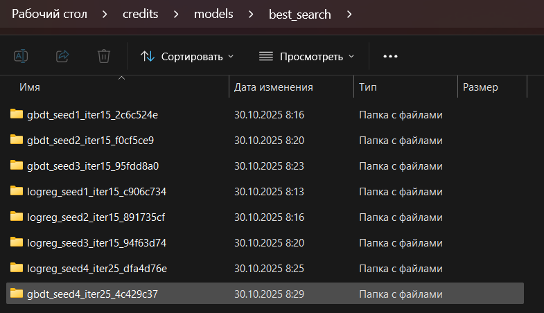
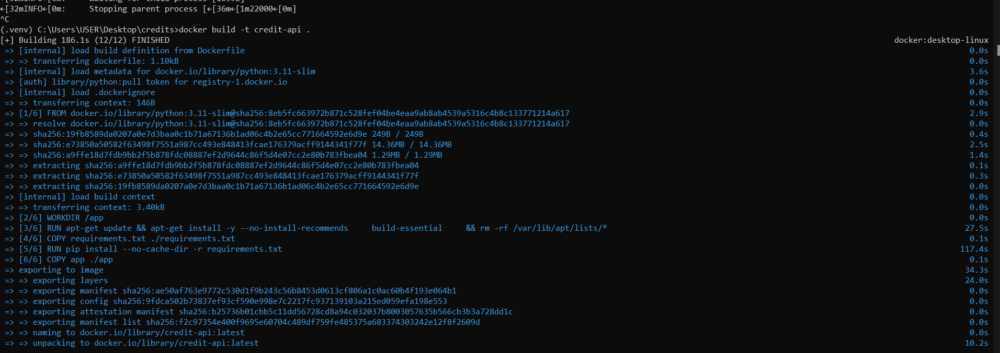
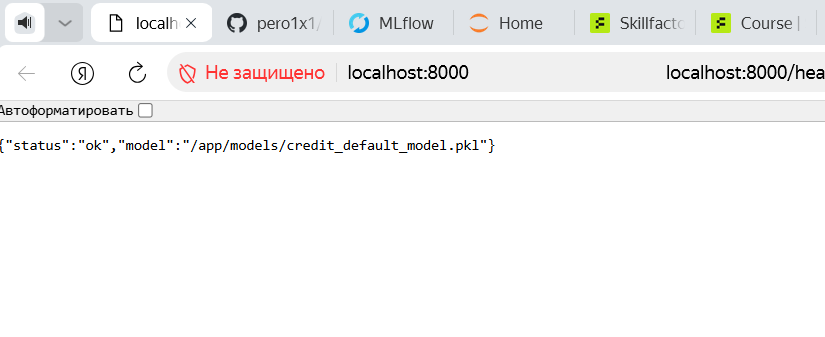

# README.md

```markdown
# Credit Default Prediction — end-to-end MLOps

Стек: **Python 3.11, scikit-learn, DVC, MLflow, FastAPI, Docker, Pandera, flake8/black/isort, GitHub Actions**.  
Цель: построить и автоматизировать пайплайн PD-модели (вероятность дефолта) на датасете **Default of Credit Card Clients**.

<p align="center">
  
</p>

## Содержание
- [Структура репо](#структура-репо)
- [Быстрый старт](#быстрый-старт)
- [Пайплайн DVC](#пайплайн-dvc)
- [Эксперименты и MLflow](#эксперименты-и-mlflow)
- [API (FastAPI) и Docker](#api-fastapi-и-docker)
- [Мониторинг дрифта (PSI)](#мониторинг-дрифта-psi)
- [Качество кода и CI](#качество-кода-и-ci)
- [Скриншоты](#скриншоты)

---

## Структура репо

```

.
├── app/                      # FastAPI сервис (/health, /predict)
├── data/
│   ├── raw/                  # исходные данные
│   └── processed/            # train/test после препроцесса
├── models/                   # сериализованные модели
├── src/
│   ├── data/                 # prepare, quality_report
│   ├── features/             # feature engineering
│   ├── models/               # train, search (RandomizedSearchCV)
│   └── monitor/psi.py        # PSI-анализ
├── artifacts/                # отчёты PSI, метрики и т.п.
├── reports/img/              # скриншоты
├── mlruns/                   # трекинг MLflow (локально)
├── dvc.yaml / dvc.lock       # описание DVC-пайплайна
├── requirements.txt
├── Dockerfile
├── Makefile
└── .github/workflows/
├── ci.yml                # lint + tests + dvc repro
└── ci-docker.yml         # docker build & push on tag

````

---

## Быстрый старт

1) Клонируем и ставим зависимости:
```bash
python -m venv .venv
# активируй venv и затем
pip install -r requirements.txt
````

2. Прогоняем весь пайплайн:

```bash
dvc repro
```

3. Проверяем качество кода и тесты (или одной командой):

```bash
make check
# включает: make format && make lint && make test
```

4. MLflow UI (локально):

```bash
make mlflow-ui
# открой http://localhost:5000
```

---

## Пайплайн DVC

Стадии (см. `dvc.yaml`):

* **prepare** → загрузка/сплит
* **features** → генерация фич
* **train** → обучение базовой модели и сохранение `models/credit_default_model.pkl`
* **monitor** → расчёт PSI по train vs test (`artifacts/psi.json`)

Запуск:

```bash
make dvc-repro
```

---

## Эксперименты и MLflow

Гиперпараметрический поиск для двух пайплайнов (LogReg/GBDT) — `src/models/search.py` (RandomizedSearchCV, scoring=roc_auc, cv=3).
Лучшие модели и метрики логируются в MLflow, артефакт `model` доступен в UI.

Пример запуска поиска:

```bash
make search
# сохранение лучшей модели в models/best_search_model
```

Скриншоты:

<p align="center">
  
</p>

---

## API (FastAPI) и Docker

Локально (без Docker):

```bash
make api PORT=8000
# /docs → Swagger UI, /health
```

### Docker

Собрать:

```bash
make docker-build DOCKER_IMG=credit-api TAG=latest
```

Запустить (с подмонтированной локальной папкой `models/`):

> **Windows (PowerShell/Linux/Mac):**

```bash
make docker-run DOCKER_IMG=credit-api TAG=latest PORT=8000
```

> **Windows CMD (если вручную):**

```bat
docker run --rm -d --name credit-api -p 8000:8000 ^
  -v %cd%\models:/app/models ^
  -e MODEL_PATH=/app/models/credit_default_model.pkl ^
  credit-api:latest
```

Проверка:

```bash
curl http://localhost:8000/health
```

`POST /predict` — пример payload:

```json
{
  "LIMIT_BAL": 120000,
  "AGE": 29,
  "BILL_AMT1": 500, "BILL_AMT2": 600, "BILL_AMT3": 600, "BILL_AMT4": 600, "BILL_AMT5": 600, "BILL_AMT6": 400,
  "PAY_AMT1": 0, "PAY_AMT2": 0, "PAY_AMT3": 0, "PAY_AMT4": 0, "PAY_AMT5": 0, "PAY_AMT6": 0,
  "utilization1": 0, "payment_ratio1": 0, "max_delay": 0,
  "SEX": 2, "EDUCATION": 2, "MARRIAGE": 1,
  "PAY_0": 0, "PAY_2": 0, "PAY_3": 0, "PAY_4": 0, "PAY_5": 0, "PAY_6": 0
}
```

Ответ:

```json
{
  "proba_default": 0.26,
  "predicted_class": 0,
  "model_info": "pipeline"
}
```

<p align="center">
  
  
</p>

---

## Мониторинг дрифта (PSI)

Скрипт: `src/monitor/psi.py`
Запуск отдельно:

```bash
make psi
# отчёт → artifacts/psi.json (средний PSI и пофичево)
```

---

## Качество кода и CI

Локально:

```bash
make format   # black + isort
make lint     # flake8
make test     # pytest
```

GitHub Actions:

* **ci.yml** — формат, линт, тесты, `dvc repro`, загрузка артефактов (метрики, ROC и т.д.)
* **ci-docker.yml** — сборка Docker-образа по релиз-тегу `v*.*.*` и пуш в Docker Hub
  Для пуша выстави секреты репозитория:

  * `DOCKERHUB_USERNAME`
  * `DOCKERHUB_TOKEN`

---

## Скриншоты

<p align="center">
  
  
  
  
  
</p>

---

## Лицензия

MIT

```

---

## Что уже проверено и готово

- ✅ DVC стадии `prepare → features → train → monitor`
- ✅ MLflow трекинг + логирование артефактов и метрик
- ✅ RandomizedSearchCV для LogReg/GBDT + сохранение лучшей модели
- ✅ FastAPI `/health`, `/predict` (+ Swagger UI)
- ✅ Dockerfile и локальный run с монтированием модели
- ✅ PSI-мониторинг (отчёт в `artifacts/psi.json`)
- ✅ CI (lint/test/dvc) и workflow на Docker build по тегам
- ✅ Скриншоты в `reports/img/` — прикреплены и учтены в README

```
